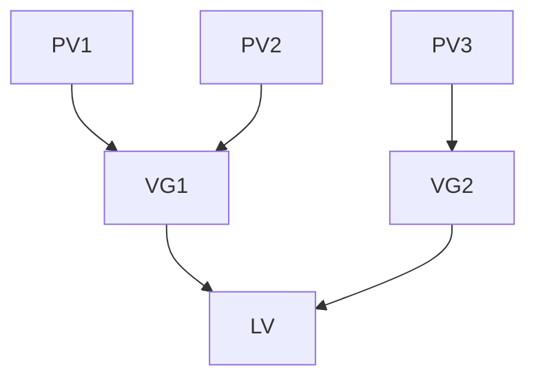

# RHCSA Study Guide

### Table of Contents
* [Stdout and Stderr](#stdour-and-stderr)
* [Bash](#bash)
    * [Bash Arguments](#bash-arguments)
* [Compression and Archiving](#compression-and-archiving)
    * [Gzip](#gzip)
    * [Bzip2](#bzip2)
    * [Tar](#tar)
* [Links](#links)
    * [Soft Links](#soft-links)
    * [Hard Links](#hard-links)
* [Processes](#processes)
    * [Find Processes](#find-processes)
    * [Kill Processes](#kill-processes)
* [Logs](#logs)
* [Reset Root Password](#reset-root-password)
* [Disk Storage](#disk-storage)
* [Logical Volume Manager](#logical-volume-manager)
    * [Physical Volumes](#physical-volumes)
    * [Volume Group](#volume-group)
    * [Logical Volume](#logical-volume)

## Stdout and Stderr

Values always used
- 0: stdin
- 1: stdout
- 2: stderr

Redict stdout

```
$ 1>
$ ./error.sh 1> capture.txt
```

Redict stderr

```
$ 2>
$ ./error.sh 2> capture.txt
```

Redict stdout to one file and stderr to another

```
$ ./error.sh 1> capture.txt 2> error.txt
```

Redirect stdout and stderr to the same file. This uses the &> to redirect instruction, which allows the shell to make one stream go to the same destination as another stream.
"redirect stream 2, stderr, to the same destination that stream 1, stdout, is being redirected to"
```
$ ./error.sh > capture.txt 2>&1
```

## Bash
- [Bash Arguments](#bash-arguments)

### Bash Arguments
Positional Paraments are arguments passed to a script which are processed in the same order in which they're sent. Index starts at 1, the positional parameter refers to this representation of the arguments using their position
```bash
$ echo "Username: $1";
$ echo "Age: $2";
```

The variable **$@** is the array of all the input parameters
```bash
$ for user in "$@"
$ do
$   echo "Username: $user"'
$ done
```

The variable **$#** returns the input size
```bash
$ i=1;
$ j=$#;
$ while [ $i -le $j ] 
$ do
$     echo "Username - $i: $1";
$     i=$((i + 1));
$     shift 1;
$ done
```

## Compression and Archiving
- [Gzip](#gzip)
- [Bzip2](#bzip2)
- [Tar](#tar)

### Gzip


Most popular, uses the command `gzip` to create a zip file in `.gz` format.
```
$ gzip filename
```
Or decompress with either `gzip -d` or using `gunzip`
```
$ gzip -d filename.gz
$ gunzip filename.gz
```

### Bzip2
Well-known and available on most major Linux distros. Can compress using the command `bzip2` to create a zip file in `.bz2` format.
`-z` enables file compression
```
$ bzip2 filename
$ bzip2 -z filename
```
Use `bzip2 -d` in order to decompress files
```
$ bzip2 -d filename.bz2
```

### Tar
The `tar` utility stands for *tape archive* which allows to create backups using `tar gzip bzip`. It compresses files and directories into an archive file known as a *tarball*.

Creating a backup of of the directory
- `-c` Create the archive
- `-v` Show the process verbosely
- `-f` Name the archive
```
$ tar -cvf backup.tar /home/user
```

Creating a `gzip` archive backup of of the directory
- `-c` Create the archive
- `-v` Show the process verbosely
- `-f` Name the archive
- `-z` Compressed gzip archive file
```
$ tar -cvfz backup.tar.gz /home/user
```
We can extract the archive file the `-x` switch

Extracting a `gzip` archive backup of of the directory
```
$ tar -xvfz backup.tar.gz
```
Extracting archive backup of of the directory
```
$ tar -xvf backup.tar
```

## Links
- [Soft Links](#soft-links)
- [Hard Links](#hard-links)

### Soft Links
Symbolic link, soft link/symlink, is a special file that serves as a reference to another file or directory.
Created with the `ln` command and `-s` switch
```bash
$ ln -s {source-filename} {symbolic-filename/symbolic-dir-name}
$ ln -s file1 link1
```

### Hard Links
The link is between the filename and the actual data stored on the filesystem. Creating a hard link creates a new filename pointing to the extact same data as the old filename. Changes made to one filename, the other reflects those changes. The permissions, link count, owenership, time stamps, and file content are the exact same, data is only removed from your drive when all links to the data have been removed
```bash
$ ln {source-filename} {symbolic-filename/dir-name}
$ ln link_test /tmp/link_new
```

## Processes
- [Find Processes](#find-processes)
- [Kill Processes](#kill-processes)

### Find Processes
A PID is auto assigned to each process when it is created.

You can use `pidof` or `ps` command to get the process PID. The command `pidof` finds a runnig process by name while `ps` displays information about processes while `ps aux` displays all running processes, shows user/owner column in output, and prints the processes that have not been executed from the terminal.
```
$ pidof httpd
$ ps aux | grep httpd 
```

### Kill Processes
Can kill a process with either `kill` or `killall`. The `kill` ends a process using it's PID while `killall` ends a process by the process's name.
```
$ kill {PID}
$ killall {Process-Name}
```

## Logs

The `/etc/rsyslog.conf` stores all the log locations for the different logs.

The `journalctl` command is used to view the systemd, kernel, and journal logs, which displays the oldest entries first.

You can set `journalctl` to store logs persisently by either creating the following directory
```
$ mkdir -p /var/log/journal
```
Or by by editing the `systemd-journald` configuratin file and seting Storage=auto to Storage=persistent
```bash
$ vim /etc/systemd/journald.conf
$ #Storage=auto > Storage=persistent
```

## Reset Root Password

Reboot the system and on GRUB2 boot screen, press `e` key to interrupt the boot process.

At the end of the line that begins with *linux* add `rd.break` to the end of the line
```bash
linux ($root)/vmlinuz-4.18.0-80.e18.x86_64 root=/dev/mapper/rhel-root ro crash kernel=auto resume=/dev/mapper/rhel-swap rd.lvm.lv/swap rhgb quiet rd.break
```
Press `Ctrl+X` to start the system where `switch_root` prompt will appear. Remount the file system as writable
```
# mount -o remount,rw /sysroot
```
The file system is mounted as read-only in the /sysroot directory. Remounting the file system as writable allows you to change the password. Enter `chroot` environment
```
chroot /sysroot
```

The `sh-4.4#` prompt will appear, reset the root password
```
# passwd
```
Then enable SELinux relabeling process on the next system boot
```
# touch /.autorelabel
# exit
$ exit
```
## Disk Storage
The `lsblk` commands allows you to display a list of available block devices, while the `blkid` command allows you to display information about available block devices.

By default it lists all available block devices, to display information about a particular device only then specify the device name
```
$ blkid /dev/sdb1
```

The `fdisk` command suite is a partitioning utility that can list, create, and remove. To format, use the `mkfs` command instead.

List out the partitions of a disk
```
$ fdisk -l
```

Create a new partition by selectng a primary disk that has unused space
```
$ fdisk /dev/sdb
 Welcome to fdisk (util-linux 2.32.1).
 Changes will remain in memory only until you decide to write them.
 Be careful before using the write command.
 
 Does not contain a recognized partition table.
     Created a new DOS disklabel with disk identifier 0x569c5370.
    
 Command (m for help): n
 Partition type
    p   primary (0 primary, 0 extended, 4 free)
    e   extended (container for logical partitions)
 Select (default p): p
 Partition number (1-4, default 1): 1
 First sector (2048-2097151, default 2048):
 Last sector, +sectors or +size{K,M,G,T,P} (2048-2097151, default 2097151): +500
    
 Created a new partition 1 of type 'Linux' and of size 250.5 KiB.
 **Be sure to write your changes to disk using the `w` flag**
```

Deleting a partition would be same command.
```
$ fdisk /dev/sdb
 Welcome to fdisk (util-linux 2.32.1).
 Changes will remain in memory only until you decide to write them.
 Be careful before using the write command.
    
 Command (m for help): d
 Selected partition 1
 Partition 1 has been deleted.
```
## Logical Volume Manager
- [Physical Volumes](#physical-volumes)
- [Volume Group](#volume-group)
- [Logical Volume](#logical-volume)





### Physical Volumes
A physical volume is any physical storage device that has been initialized as a physical volume with LVM.
LVM places labels on the physical volumes' UUID and metadata storage when initialized.
Uses the `pvs` command to to see what physical volumes are configured. To add additional PV, use the `pvcreate` command.
```
$ pvs
$ pvcreate /dev/sdb
```

### Volume Group
Physical volumes are combined into volume groups (VGs), which creates a pool of disk space out of which logical volumes can be allocated.
Within a volume group, the disk space available for allocation is divided into units of a fixed-size called extents. An extent is the smallest unit of space that can be allocated. Within a physical volume, extents are referred to as physical extents.

To create a volume group, use `vgcreate` command which wil create a new volume group by name and adds at least one physical volume to it.

```
$ vgcreate vg1 /dev/sdb1
```

Use the `vgs` command to view existing volume groups. To add additional physical volumes to an existing volume gorup, use `vgextend` command. And to remove the physical volume, uses the `vgreduce` command.

```
$ vgextend vg1 /dev/sdc1
$ vgreduce vg1 /dev/sdb1
```

### Logical Volume
Logical volumes are made up of volume groups.